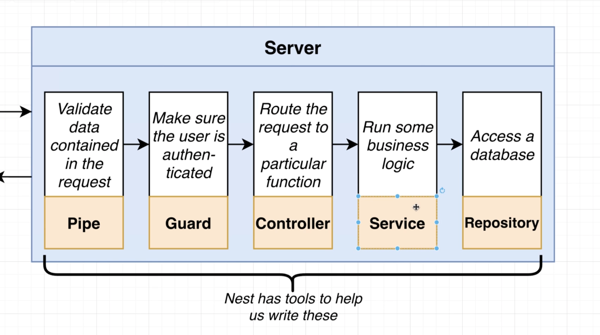
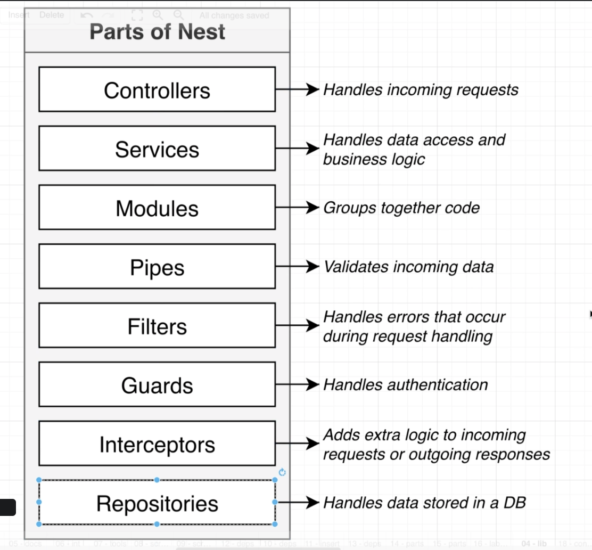
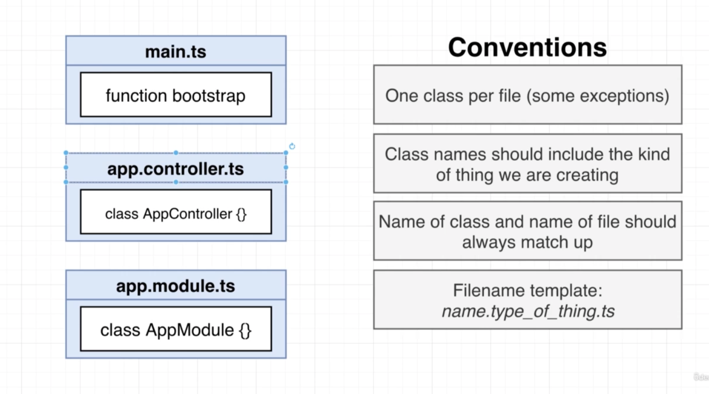
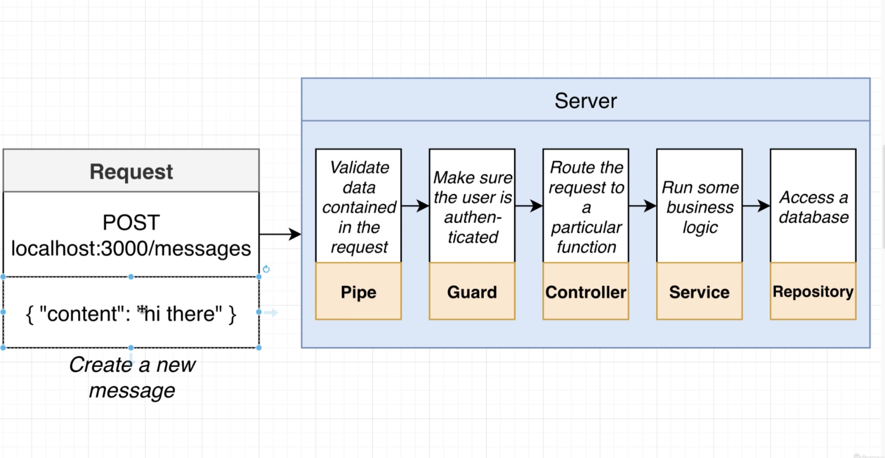
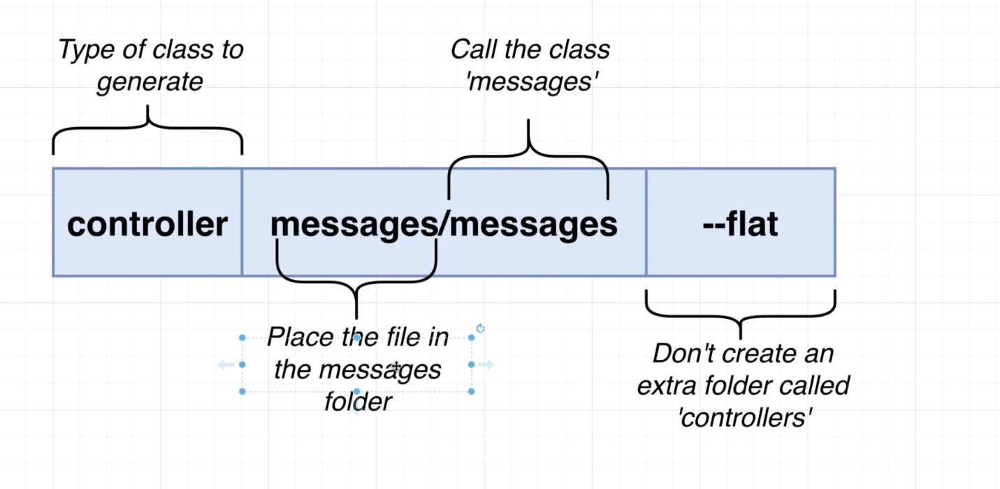
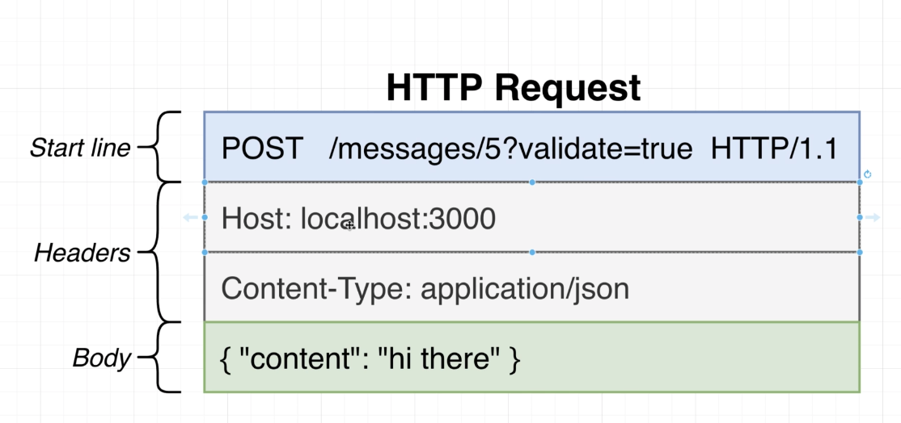

## Config
### Packages
@nestjs/common@7.6.17                    -> functions and classes and etc
@nestjs/core@7.6.17                      -> ?
@nestjs/platform-express@7.6.17          -> use expressjs to handle http request
reflect-metadata@0.1.13 typescript@4.3.2 -> make decorators work.
typescript                               -> write nest apps with typescript

### tsconfig
"module": "commonjs", erv              
"target": "es2017",
"experimentalDecorators": true,
"emitDecoratorMetadata": true 

---

### Naming Convention

## Message service

## Generate Service

## Vscode Http Request Extention
